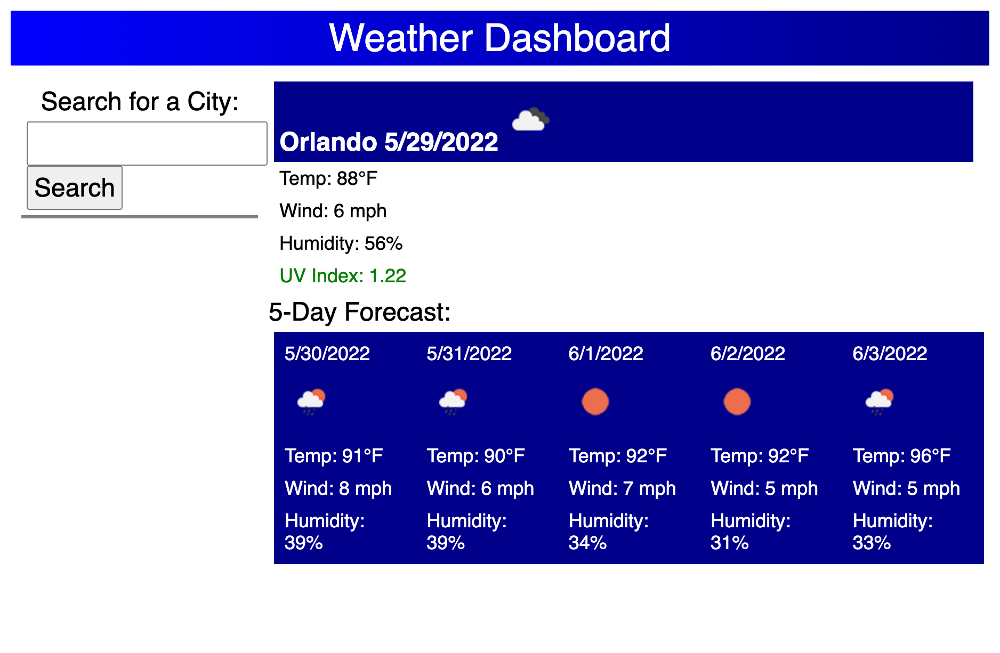

# Weather Dashboard

## Website Purpose

A weather "dashboard" that displays current and future conditions for the city entered.

## Page Built With

- HTML 5
- Basic CSS 3
- JavaScript ES6 / ES2015
- OpenWeather One-Call 2.5 API

## Usage

Enter a city and click on Search. The local conditions for that city are displayed. The five-day forecast for that city will be displayed underneath that.

## Website URL

https://anillag.github.io/Challenge-6-Weather-Dashboard/

## Contributors

Made with ❤️ by Joe Gallina

### ©️2022 Joe Gallina
